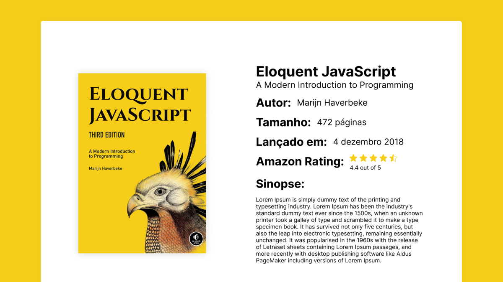

<h1>Random Books </h1>

  A page that displays random books on every refresh.
  

<h2>Techs</h2>

It was used to build this application:

- Frontend
  - HTML
  - CSS
  - JavaScript

<h2>Layout</h2>

You can view the project layout through [from this link](https://www.figma.com/file/MmOz3TM0kaSPcevcxq7wRU/Random-Books?node-id=0%3A1). It is necessary to have an account [Figma](https://figma.com) to access it.

<h2>About</h2>

With this project we aimed to indicate good books every time the page is reloaded. For the books data we use an Array-list which shows every week a list of top books.

  

<h2>License</h2>

Licensed under the <a href="./LICENSE">MIT</a> license.
